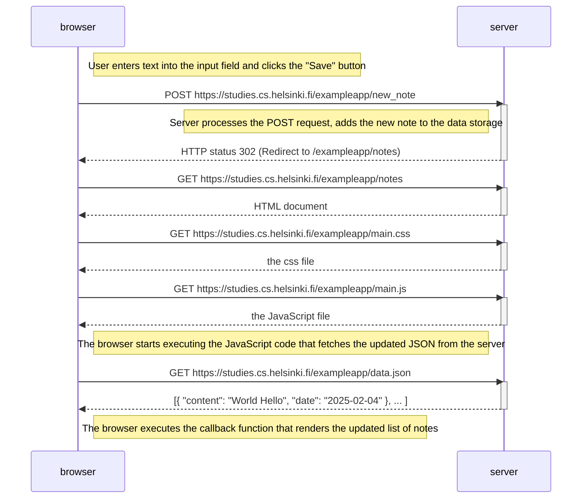

# New Note Creation Diagram

The following diagram depicts the sequence of events when a user creates a new note on the page `https://studies.cs.helsinki.fi/exampleapp/notes`.

```mermaid
sequenceDiagram
    participant browser
    participant server

    Note right of browser: User enters text into the input field and clicks the "Save" button
    browser->>server: POST https://studies.cs.helsinki.fi/exampleapp/new_note
    activate server
    Note left of server: Server processes the POST request, adds the new note to the data storage
    server-->>browser: HTTP status 302 (Redirect to /exampleapp/notes)
    deactivate server

    browser->>server: GET https://studies.cs.helsinki.fi/exampleapp/notes
    activate server
    server-->>browser: HTML document
    deactivate server

    browser->>server: GET https://studies.cs.helsinki.fi/exampleapp/main.css
    activate server
    server-->>browser: the css file
    deactivate server

    browser->>server: GET https://studies.cs.helsinki.fi/exampleapp/main.js
    activate server
    server-->>browser: the JavaScript file
    deactivate server

    Note right of browser: The browser starts executing the JavaScript code that fetches the updated JSON from the server
    browser->>server: GET https://studies.cs.helsinki.fi/exampleapp/data.json
    activate server
    server-->>browser: [{ "content": "World Hello", "date": "2025-02-04" }, ... ]
    deactivate server

    Note right of browser: The browser executes the callback function that renders the updated list of notes
```
