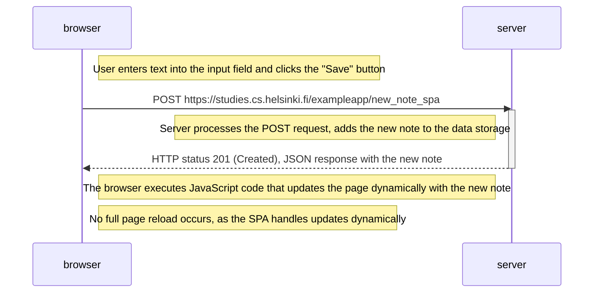

# New Note Creation in Single-Page App (SPA) Diagram

The following diagram depicts the sequence of events when a user creates a new note using the single-page app version of the notes app at `https://studies.cs.helsinki.fi/exampleapp/spa`.

